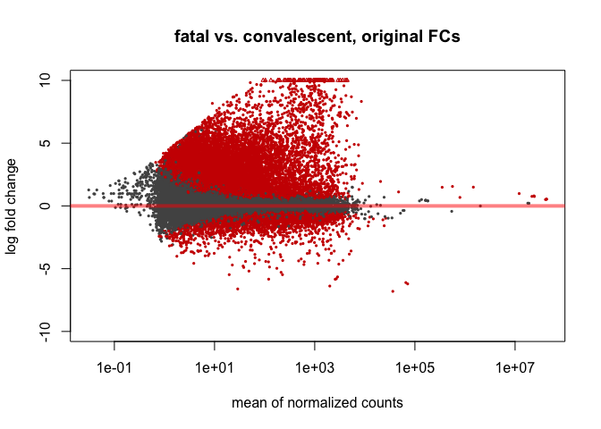
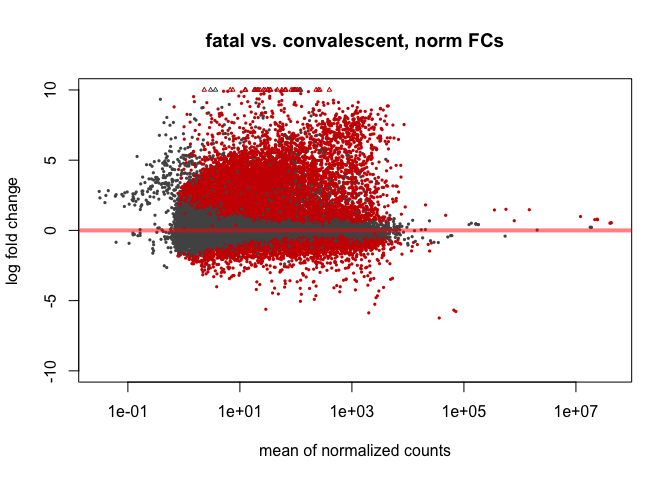

Transcript counts were obtained previously using featureCounts.

Load needed libraries and the data:

```r
library("DESeq2")
library("vsn")
library("RColorBrewer")
library("pheatmap")
library("EnhancedVolcano")

counts <- read.table('output/counts.txt', skip=1, header=TRUE, row.names="Geneid")
drops <- c("Chr","Start", "End", "Strand", "Length")
counts <- counts[, !(names(counts) %in% drops)]

head(counts[,c(1,2)])
```

```
##              X.ExpOut.Hsapiens_EBOV_subset.Out.Rep.Bams.Hsapiens.CONVAL1.a.bam
## MIR6859-1                                                                    6
## MIR1302-2HG                                                                  0
## MIR1302-2                                                                    0
## FAM138A                                                                      0
## OR4F5                                                                        0
## LOC100996442                                                               549
##              X.ExpOut.Hsapiens_EBOV_subset.Out.Rep.Bams.Hsapiens.CONVAL1.b.bam
## MIR6859-1                                                                   11
## MIR1302-2HG                                                                  0
## MIR1302-2                                                                    0
## FAM138A                                                                      0
## OR4F5                                                                        0
## LOC100996442                                                              3076
```
Format the sample names nicely, and create a factor that groups the samples properly into convalescent, survival, and fatal outcomes:

```r
cols <- colnames(counts)
coldata <- matrix(nrow=dim(counts)[2],ncol=1)
n <- 1
for(x in cols){
   x <- substring(x,first = 53,last = nchar(x)-4)
   cols[n] <- x
   coldata[n] <- x
   n <- n+1
}
colnames(counts) <- cols
rownames(coldata) <- coldata[,1]
colnames(coldata) <- c("outcome")
coldata <- as.data.frame(coldata)
coldata$outcome <- substring(coldata$outcome,1,3)
coldata$outcome <- factor(coldata$outcome)

head(coldata)
```

```
##           outcome
## CONVAL1.a     CON
## CONVAL1.b     CON
## CONVAL1.c     CON
## CONVAL1.d     CON
## CONVAL1.e     CON
## CONVAL1.f     CON
```
Make the DESeq data object:

```r
dds <- DESeqDataSetFromMatrix(countData=counts,colData=coldata,design=~outcome)

dds
```

```
## class: DESeqDataSet 
## dim: 38084 30 
## metadata(1): version
## assays(1): counts
## rownames(38084): MIR6859-1 MIR1302-2HG ... TRNT TRNP
## rowData names(0):
## colnames(30): CONVAL1.a CONVAL1.b ... SURVIVE1.i SURVIVE1.j
## colData names(1): outcome
```
Discard very lowly expressed genes:

```r
keep <- rowSums(counts(dds)) >= 30
dds <- dds[keep,]

dds
```

```
## class: DESeqDataSet 
## dim: 29870 30 
## metadata(1): version
## assays(1): counts
## rownames(29870): MIR6859-1 LOC100996442 ... TRNT TRNP
## rowData names(0):
## colnames(30): CONVAL1.a CONVAL1.b ... SURVIVE1.i SURVIVE1.j
## colData names(1): outcome
```
Do the actual DE analysis, and look at summaries of the comparisons:

```r
dds <- DESeq(dds)
resFAT <- results(dds, name="outcome_FAT_vs_CON")
resSUR <- results(dds, name="outcome_SUR_vs_CON")

summary(resFAT, alpha=0.01)
```

```
## 
## out of 29865 with nonzero total read count
## adjusted p-value < 0.01
## LFC > 0 (up)       : 7700, 26%
## LFC < 0 (down)     : 2004, 6.7%
## outliers [1]       : 0, 0%
## low counts [2]     : 5, 0.017%
## (mean count < 0)
## [1] see 'cooksCutoff' argument of ?results
## [2] see 'independentFiltering' argument of ?results
```

```r
summary(resSUR, alpha=0.01)
```

```
## 
## out of 29865 with nonzero total read count
## adjusted p-value < 0.01
## LFC > 0 (up)       : 910, 3%
## LFC < 0 (down)     : 454, 1.5%
## outliers [1]       : 0, 0%
## low counts [2]     : 2321, 7.8%
## (mean count < 2)
## [1] see 'cooksCutoff' argument of ?results
## [2] see 'independentFiltering' argument of ?results
```
Do shrinkage of the LFCs:

```r
resFAT_LFCape <- lfcShrink(dds,coef="outcome_FAT_vs_CON", type="apeglm")
resFAT_LFCnorm <- lfcShrink(dds,coef="outcome_FAT_vs_CON", type="norm")

resSUR_LFCape <- lfcShrink(dds,coef="outcome_SUR_vs_CON", type="apeglm")
resSUR_LFCnorm <- lfcShrink(dds,coef="outcome_SUR_vs_CON", type="norm")
```
Compare the two LFC shrinkage methods:

```r
plotMA(resFAT,main='fatal vs. convalescent, original FCs',ylim=c(-10,10))
```

<!-- -->

```r
plotMA(resFAT_LFCape,main='fatal vs. convalescent, apeglm FCs',ylim=c(-10,10))
```

<!-- -->

```r
plotMA(resFAT_LFCnorm,main='fatal vs. convalescent, norm FCs',ylim=c(-10,10))
```

<!-- -->

```r
plotMA(resSUR,main='survive vs. convalescent, original FCs',ylim=c(-4,4))
```

<!-- -->

```r
plotMA(resSUR_LFCape,main='survive vs. convalescent, apeglm FCs',ylim=c(-4,4))
```

<!-- -->

```r
plotMA(resSUR_LFCnorm,main='survive vs. convalescent, norm FCs',ylim=c(-4,4))
```

<!-- -->

The normal shrinkage method appears to perform best for these data.

Sort the results by p-value and inspect them:

```r
resFAT_norm_ordered <- resFAT_LFCnorm[order(resFAT_LFCnorm$pvalue),]
resSUR_norm_ordered <- resSUR_LFCnorm[order(resSUR_LFCnorm$pvalue),]

head(resFAT_norm_ordered,3)
```

```
## log2 fold change (MAP): outcome FAT vs CON 
## Wald test p-value: outcome FAT vs CON 
## DataFrame with 3 rows and 6 columns
##                 baseMean   log2FoldChange             lfcSE             stat
##                <numeric>        <numeric>         <numeric>        <numeric>
## SLC36A2 3220.14989720136 8.65165044507707 0.640685703148369  14.968176349887
## RBMY1A1 4284.38022007594 8.85665428900187 0.675850471389601 14.9429285275117
## RBMY1D  4450.13676956214 8.86132590309538 0.677749545172747 14.8534923514712
##                       pvalue                 padj
##                    <numeric>            <numeric>
## SLC36A2 1.18527010300407e-50 2.58621182696593e-46
## RBMY1A1 1.73193492514042e-50 2.58621182696593e-46
## RBMY1D  6.60368919321585e-50 6.57397259184637e-46
```

```r
head(resSUR_norm_ordered,3)
```

```
## log2 fold change (MAP): outcome SUR vs CON 
## Wald test p-value: outcome SUR vs CON 
## DataFrame with 3 rows and 6 columns
##                 baseMean    log2FoldChange             lfcSE              stat
##                <numeric>         <numeric>         <numeric>         <numeric>
## YBX3    1486.24644015913 -2.76530098157116 0.271842741608316 -10.2043033775658
## MNX1    1023.98973017425  4.18818723730788 0.498655835855311  10.1896706558713
## RBMY1A1 4284.38022007594  3.57825496536106 0.511576279743496  10.0674702586053
##                       pvalue                 padj
##                    <numeric>            <numeric>
## YBX3    1.89677370579402e-24 3.03741454071693e-20
## MNX1    2.20509967019995e-24 3.03741454071693e-20
## RBMY1A1 7.69313667035055e-24 6.61196252482173e-20
```
Make volcano plots for the two comparisons:

```r
EnhancedVolcano(resFAT_LFCnorm, lab=rownames(resFAT_LFCnorm),x='log2FoldChange',y='pvalue',title='fatal vs. convalescent')
```

<!-- -->

```r
EnhancedVolcano(resSUR_LFCnorm, lab=rownames(resSUR_LFCnorm),x='log2FoldChange',y='pvalue',title='survive vs. convalescent')
```

<!-- -->

Plot the dispersion estimates for quality control:

```r
plotDispEsts(dds)
```

<!-- -->

Some visual analysis (heatmap, PCA) on a normalized version of the counts:

```r
ntd <- normTransform(dds)

sampleDists <- dist(t(assay(ntd)))
sampleDistMatrix <- as.matrix(sampleDists)
rownames(sampleDistMatrix) <- ntd$outcome
colnames(sampleDistMatrix) <- ntd$outcome
colors <- colorRampPalette( rev(brewer.pal(9, "Blues")) )(255)
pheatmap(sampleDistMatrix,
         clustering_distance_rows=sampleDists,
         clustering_distance_cols=sampleDists,
         col=colors)
```

<!-- -->

The outcomes are generally grouped together, with a few exceptions. Three of the fatal samples appear to be very "far" from most of the other samples.

```r
plotPCA(ntd,intgroup="outcome")
```

<!-- -->

PCA appears to group the outcomes together decently well. Looks like there's more variation within the fatal and survival groups than the convalescent group, which agrees with the notion of entropy.

Finally, calculate the entropies for the two comparisons:

```r
# fatal vs. convalescent entropy
0.5*log(2*pi*exp(1)*var(resFAT_LFCnorm$log2FoldChange))
```

```
## [1] 2.085752
```

```r
# survival vs. convalescent entropy
0.5*log(2*pi*exp(1)*var(resSUR_LFCnorm$log2FoldChange))
```

```
## [1] 1.003654
```
