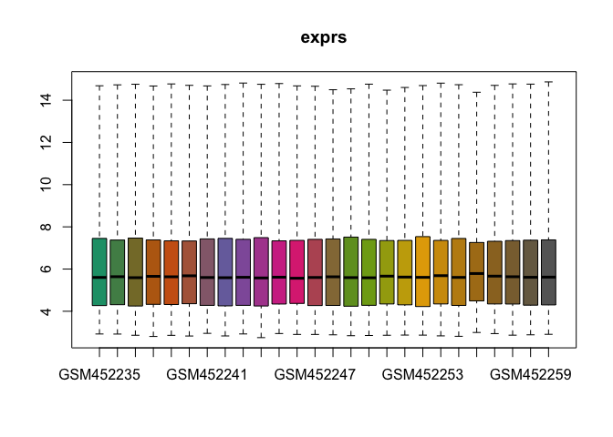
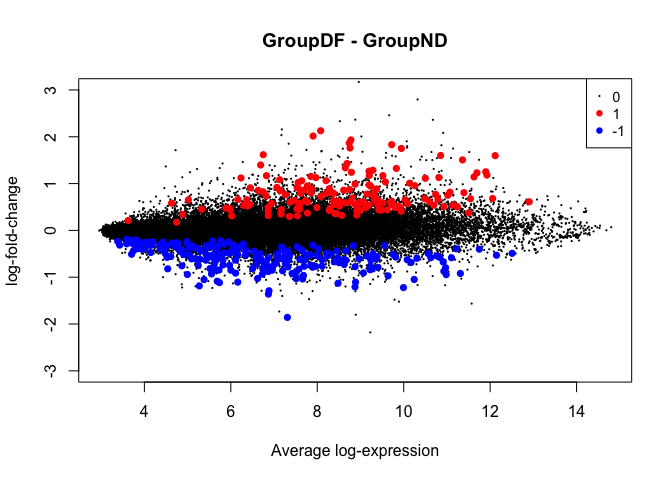
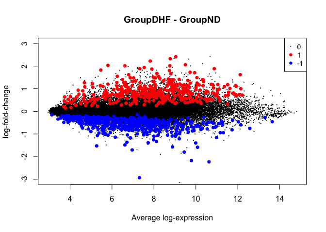

The raw data (.CEL files) were downloaded from GEO accession GSE18090.

Load needed libraries and sample info (contained in targets.txt), including file names for the raw data:

```r
library(Biobase)
library(limma)
library(affy)
library(AnnotationDbi)
library(hgu133plus2.db)
library(dplyr)
library(oligo)

dir()
```

```
##  [1] "MD_figs" "DEanalysis.html"  "DEanalysis.md"    "DEanalysis.Rmd"  
##  [5] "GSM452235.CEL"    "GSM452236.CEL"    "GSM452237.CEL"    "GSM452238.CEL"   
##  [9] "GSM452239.CEL"    "GSM452240.CEL"    "GSM452241.CEL"    "GSM452242.CEL"   
## [13] "GSM452243.CEL"    "GSM452244.CEL"    "GSM452245.CEL"    "GSM452246.CEL"   
## [17] "GSM452247.CEL"    "GSM452248.CEL"    "GSM452249.CEL"    "GSM452250.CEL"   
## [21] "GSM452251.CEL"    "GSM452252.CEL"    "GSM452253.CEL"    "GSM452254.CEL"   
## [25] "GSM452255.CEL"    "GSM452256.CEL"    "GSM452257.CEL"    "GSM452258.CEL"   
## [29] "GSM452259.CEL"    "GSM452260.CEL"    "targets.txt"
```

```r
targets <- read.delim("targets.txt",row.names = 1)
head(targets)
```

```
##                FileName Group Experiment
## GSM452235 GSM452235.CEL    DF          1
## GSM452236 GSM452236.CEL    DF          2
## GSM452237 GSM452237.CEL    DF          3
## GSM452238 GSM452238.CEL    DF          4
## GSM452239 GSM452239.CEL    DF          5
## GSM452240 GSM452240.CEL    DF          6
```

Load data (all the necessary normalization steps, plus log transformation, are done by justRMA), and make sure the resulting ExpressionSet is properly formatted:

```r
eset <- justRMA(filenames = targets$FileName)
colnames(eset) <- row.names(targets)
exprs(eset)[1:5,1:5]
```

```
##           GSM452235 GSM452236 GSM452237 GSM452238 GSM452239
## 1007_s_at  6.811380  7.004681  6.505195  7.184183  6.743454
## 1053_at    7.143722  7.267081  6.869625  6.535772  7.848622
## 117_at     7.862121  8.627632  7.470589  7.569938  6.806785
## 121_at     8.461594  8.806956  8.544209  8.837012  8.449578
## 1255_g_at  3.471336  3.577892  3.410388  3.516285  3.453731
```

Plot the normalized and logged expression values for the samples:

```r
oligo::boxplot(eset)
```

<!-- -->

The samples' expression values are reasonably median-centered and well-normalized, so we can proceed. 

The next step is to translate the probe IDs from the raw .CEL files to usable gene IDs. This is a bit tricky since one probe can map to more than one gene. The collapser function ensures that all the possible gene IDs are combined into one row, so that we have one row in 'mappings' per probe.

```r
collapser <- function(x){
  x %>% unique %>% sort %>% paste(collapse = "|")
}

mappings <- AnnotationDbi::select(
  x       = hgu133plus2.db,
  keys    = rownames(eset),
  columns = c("PROBEID", "ENSEMBL", "ENTREZID", "SYMBOL"),
  keytype = "PROBEID"
) %>%
  group_by(PROBEID) %>%
  summarise_each(funs(collapser)) %>%
  ungroup
```

```
## 'select()' returned 1:many mapping between keys and columns
```

Check that the ID translation is successful:

```r
dim(mappings)
```

```
## [1] 54675     4
```

```r
dim(eset)
```

```
## Features  Samples 
##    54675       26
```

```r
all(mappings$PROBEID == rownames(eset))
```

```
## [1] TRUE
```

Assign the obtained gene IDs to the featureData slot of the ExpressionSet:

```r
fd <- new("AnnotatedDataFrame",
          data = data.frame(mappings[, -1], stringsAsFactors = FALSE)
)
rownames(fd) <- mappings$PROBEID
featureData(eset) <- fd
```

Make the design matrix using the three groups (non-dengue febrile illness, dengue fever, and dengue hemorrhagic fever), and fit an initial linear model:

```r
Group <- factor(targets$Group, levels = c("ND", "DF", "DHF"))
design <- model.matrix(~Group + 0, eset)
fit <- lmFit(eset, design)
```

Make a contrast matrix to specify the DE comparisons we want (dengue vs. non-dengue, and dengue hemorrhagic vs. non-dengue), and fit a linear model correspondingly:

```r
cont.matrix <- makeContrasts(GroupDF-GroupND, GroupDHF-GroupND, levels=design)
fit2 <- contrasts.fit(fit, cont.matrix)
fit2 <- eBayes(fit2)
```

To decide a p-value cutoff for significance, look at the p-values for the control probes, which we expect not to be differentially expressed:

```r
i <- grep("AFFX",featureNames(eset))
summary(fit2$F.p.value[i])
```

```
##    Min. 1st Qu.  Median    Mean 3rd Qu.    Max. 
## 0.01923 0.44444 0.61399 0.64190 0.89901 0.99295
```

None of the control probes have a p-value below 0.01, so this is a safe cutoff to use for significance. Now, determine which genes are significantly up- or down-regulated according to this cutoff:

```r
results <- classifyTestsF(fit2, p.value=0.01)
summary(results)
```

```
##    GroupDF - GroupND GroupDHF - GroupND
## -1               229                447
## 0              54293              53843
## 1                153                385
```

Plot the results, highlighting differentially expressed genes:

```r
plotMD(fit2,coef=1,status=results[,1],values=c(1,-1),hl.col=c("red","blue"),ylim=c(-3,3))
```

<!-- -->

```r
plotMD(fit2,coef=2,status=results[,2],values=c(1,-1),hl.col=c("red","blue"),ylim=c(-3,3))
```

<!-- -->

Capture the log fold changes for each comparison:

```r
DF_FCs <- topTable(fit2,coef="GroupDF - GroupND",n=Inf)$logFC
DHF_FCs <- topTable(fit2,coef="GroupDHF - GroupND",n=Inf)$logFC
```

Calculate the entropy for each comparison:

```r
# DF vs. ND
0.5*log(2*pi*exp(1)*var(DF_FCs))
```

```
## [1] -0.0607957
```

```r
# DHF vs. ND
0.5*log(2*pi*exp(1)*var(DHF_FCs))
```

```
## [1] 0.101914
```

The DHF vs. ND comparison has a higher entropy, which agrees with the notion of entropy: DHF is a more severe illness (i.e. greater stress on the host) than DF.
